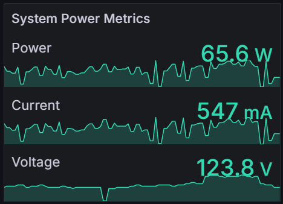

# Tuya Smart Plug Exporter (Python)

<p align="center">
  
  
</p>

Prometheus exporter for **Tuya-based smart plugs** using **TinyTuya**.

It polls your plugs on your local network and exposes metrics on `/metrics`.  
It can also **auto-discover** the right DPS keys (voltage, current, power, relay) and scaling, so your `config.yaml` can stay minimal.

<p align="center">
  
</p>

## Features

- Metrics on `/metrics`
- Multi-device polling with parallel requests
- Auto version probing (Tuya protocol versions)
- Autodiscovery for:
  - Voltage, current, power DPS keys
  - Relay DPS key (on/off)
  - Scaling (divisors)
- Health and readiness endpoints
  - `/-/healthy` (or `/healthz`)
  - `/-/ready` (or `/readyz`)

## Requirements

- Python 3.10+ (3.11 recommended)
- Network access to your smart plugs (local LAN)
- Tuya `device_id` and `local_key` for each plug
- tinytuya, prometheus-client, pyyaml

## Install

```bash
pip install -r requirements.txt
```

## Run

```bash
python tuya_exporter.py --config.file=config.yaml
```

Optional flags:

- `--web.listen-address="0.0.0.0:9999"`
- `--web.telemetry-path="/metrics"`
- `--log.level=INFO`

## Getting device_id and local_key

To use this exporter you need the Tuya `device_id` and `local_key` for each smart plug.

Tuya does not provide an official way to retrieve the local key.  
The most common and reliable method is explained in **[this tutorial](https://www.youtube.com/watch?v=Q1ZShFJDvE0)**.

Notes:
- This is an older method, but it still works for many Tuya devices.
- Tuya frequently changes their cloud APIs, so the process may break in the future.
- Once you have the `local_key`, it usually does not change unless you re-pair the device.

## Configuration

Create a `config.yaml` (or JSON). The exporter reads it with `--config.file`.

### Minimal config (autodiscovery enabled)

With autodiscovery enabled, you only need `ip`, `device_id`, and `local_key` per device.

```yaml
web:
  listen_address: "0.0.0.0:9999"
  telemetry_path: "/metrics"

scrape:
  timeout_seconds: 3.0
  max_parallel: 8
  stale_seconds: 300
  poll_interval_seconds: 10
  ready_grace_seconds: 30

  inferred_on_power_w: 3.0
  inferred_off_power_w: 1.5
  inferred_on_current_a: 0.03
  inferred_off_current_a: 0.015

tuya:
  versions: [3.4, 3.3, 3.2, 3.1, 3.0]

autodiscovery:
  enabled: true
  threshold: 0.85
  relay_threshold: 0.60
  samples: 4
  tol_rel: 0.30
  min_power_w: 8.0
  min_current_a: 0.05
  probe_dps: [1,2,3,4,5,6,7,8,9,10,11,12,13,14,15,16,17,18,19,20,21,22,23,24,25]

devices:
  - name: "plug-1"
    ip: "192.168.0.50"
    device_id: "DEVICE_ID_1"
    local_key: "LOCAL_KEY_1"

  - name: "plug-2"
    ip: "192.168.0.51"
    device_id: "DEVICE_ID_2"
    local_key: "LOCAL_KEY_2"
```

### Manual config (autodiscovery disabled)

If you set `autodiscovery.enabled: false`, each device must include `dps` and `scale`.

```yaml
autodiscovery:
  enabled: false

devices:
  - name: "plug-1"
    ip: "192.168.0.50"
    device_id: "DEVICE_ID_1"
    local_key: "LOCAL_KEY_1"
    dps:
      voltage: "20"
      current: "18"
      power: "19"
      relay: "1"
    scale:
      voltage: 10
      current: 100
      power: 100
```

### Autodiscovery tips

- It needs **at least 2 polls** (usually 4+ is better).
- It works best if the plug has a **real load connected** (not near zero).
- Until it finishes, you will see:
  - `tuya_autodiscovery_pending = 1`
  - `tuya_telemetry_ok = 0`
  - no `tuya_consumption_*` values yet

## Endpoints

- Metrics: `/metrics`
- Health: `/-/healthy` (or `/healthz`)
- Ready: `/-/ready` (or `/readyz`)

## Prometheus scrape config

Add this to your Prometheus config:

```yaml
scrape_configs:
  - job_name: "tuya-exporter"
    static_configs:
      - targets: ["YOUR_EXPORTER_IP:9999"]
```

## Metrics

| Name | Type | Description | Scope |
|---|---|---|---|
| `tuya_up` | Gauge | Last scrape was OK (1) or failed (0) | Device |
| `tuya_telemetry_ok` | Gauge | Last poll had valid voltage, current, power (1) or not (0) | Device |
| `tuya_consumption_voltage` | Gauge | Voltage in volts | Device |
| `tuya_consumption_current` | Gauge | Current in amps | Device |
| `tuya_consumption_power` | Gauge | Power in watts | Device |
| `tuya_relay_state` | Gauge | Relay state from DPS (1 on, 0 off, -1 unknown) | Device |
| `tuya_relay_inferred` | Gauge | Relay inferred from consumption (1 on, 0 off) | Device |
| `tuya_relay_effective` | Gauge | Uses relay DPS if known, else inferred | Device |
| `tuya_last_success_timestamp` | Gauge | Unix timestamp of last successful scrape | Device |
| `tuya_last_telemetry_timestamp` | Gauge | Unix timestamp of last valid telemetry sample | Device |
| `tuya_device_scrape_duration_seconds` | Gauge | Time spent scraping a device | Device |
| `tuya_stale_seconds` | Gauge | Seconds since last valid telemetry sample (-1 never) | Device |
| `tuya_autodiscovery_ready` | Gauge | Autodiscovery ready (1) or not (0) | Device |
| `tuya_autodiscovery_pending` | Gauge | Autodiscovery pending (1) or not (0) | Device |
| `tuya_autodiscovery_confidence` | Gauge | Autodiscovery confidence score (0..1) | Device |
| `tuya_autodiscovery_attempts_total` | Counter | Autodiscovery attempts | Device |
| `tuya_autodiscovery_relay_confidence` | Gauge | Relay autodiscovery confidence (0..1) | Device |
| `tuya_autodiscovery_relay_ready` | Gauge | Relay autodiscovery ready (1) or not (0) | Device |
| `tuya_errors_total` | Counter | Total device scrape errors | Device |
| `tuya_scrapes_total` | Counter | Total device scrapes | Device |
| `tuya_last_scrape_error` | Gauge | Last poll cycle had any error (1) or not (0) | Global |
| `tuya_last_scrape_duration_seconds` | Gauge | Duration of the last poll cycle (all devices) | Global |
| `tuya_exporter_build_info` | Gauge | Exporter version and Python version | Global |

## Troubleshooting

If you get `tuya_up = 1` but `tuya_telemetry_ok = 0` forever:

- Wait a few poll cycles. `samples: 4` means it may need a bit more time.
- Plug in a device that draws real power (8W+ if you kept `min_power_w: 8.0`).
- If your plug never exposes voltage/current/power DPS, disable autodiscovery and set `dps` and `scale` manually.

If `tuya_up = 0`:

- Check IP, device_id, local_key
- Try other Tuya protocol versions in `tuya.versions`
- Check firewall rules and LAN routing

## License

This project is licensed under the [PolyForm Noncommercial License 1.0.0](./LICENSE).
