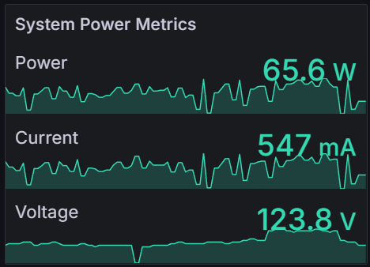

# Tuya Smart Plug Exporter 🔌📈

## Overview 📊

This script collects and exports key metrics from Tuya smart plugs to Prometheus. It tracks three important data points: <ins>power</ins> , <ins>current</ins>, and <ins>voltage</ins>. This allows you to monitor the performance of your smart plugs with ease.

<div align="center">
   
</div>

## Features 🌟

   - **Metrics Collection:** Retrieves <ins>power</ins>, <ins>current</ins>, and <ins>voltage</ins> data from Tuya smart plugs.
     
   - **Prometheus Integration:** Provides metrics in a format compatible with Prometheus scraping.
     
   - **Simple Configuration:** Easy to set up with minimal configuration required.
     
   - **Low CPU Usage:** Designed to be efficient and have a minimal impact on system resources.

## Configuration ⚙️

1. **Device Configuration:**

   Update the `DEVICE_CONFIGS` list with your device details:

   ```python
    # Device Configuration
   "ip": "DEVICE_LOCAL_IP",
   "device_id": "DEVICE_ID",
   "local_key": "LOCAL_KEY"
   ```
   If you are unsure how to obtain these following details, refer to [this tutorial](https://www.youtube.com/watch?v=Q1ZShFJDvE0)
   
   - `DEVICE_IP`: Local IP address of your Tuya smart plug.
   - `DEVICE_ID`: Unique identifier for your Tuya device.
   - `LOCAL_KEY`: Authentication key for your Tuya device.


3. **Exporter Port (Optional):**

   Set the port for the Prometheus exporter in the script:

   ```python
   EXPORTER_PORT = 9999
   ```

## Usage 🚀

1. **Install Dependencies:**

   Install the required Python packages:

   ```sh
   pip install click tinytuya prometheus_client
   ```

2. **Run the Script:**

   Launch the script to start the Prometheus exporter:

   ```sh
   python tuya_exporter.py
   ```

3. **Access Metrics:**

   After running the script, you can access the metrics at:
    
     ```init
     http://localhost:9999/metrics
     ```

## Notes 📝

- **Automatic Version Detection:** The script automatically tries different versions of the Tuya protocol to ensure connectivity. Manual adjustment is not needed for the version.
  
- **Configuration:** Ensure that device IPs, IDs, and local keys are correctly configured. You can verify these settings in the configuration section of the script.

## License 📄

This project is licensed under the Apache License 2.0 - see the [LICENSE](LICENSE) file for details.


