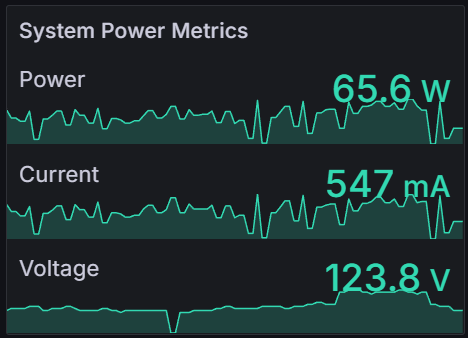

<h1 align="center">Tuya Smart Plug Exporter 🔌</h1>

<p align="center">
  
  
</p>

Prometheus exporter for **Tuya-based smart plugs** using **TinyTuya**.

It polls your plugs on your local network and exposes metrics on `/metrics`.
It can also auto-discover the right DPS keys for voltage, current, power, relay state, and scaling, so your `config.yaml` can stay minimal.

This exporter is read-only. It does not change relay state or control devices.

<p align="center">
  
</p>

## Contents

### 📦 Binary downloads

- 🐧 [Linux arm64 binary](#linux-arm64-)
- 🐧 [Linux amd64 binary](#linux-amd64-)
- 🪟 [Windows amd64 binary](#windows-amd64-)

### 🐳 Docker

- 🐧 [Linux/macOS Docker](#linuxmacos-)
- 🪟 [Windows PowerShell Docker](#windows-powershell-)

### 🛠️ Setup

- 🔧 [Configure `config.yaml`](#configuration-)
- ✅ [Verify exporter](#verify-)

## Features 📊

- Metrics on `/metrics`
- Multi-device polling with parallel requests
- Auto version probing for Tuya protocol versions
- Autodiscovery for voltage, current, power, relay state, and scaling
- Health and readiness endpoints
  - `/-/healthy` or `/healthz`
  - `/-/ready` or `/readyz`
- Docker support through GitHub Container Registry
- Prebuilt binaries for Linux and Windows

## Requirements

- Network access to your smart plugs on the local LAN
- Tuya `device_id` and `local_key` for each plug
- A `config.yaml` file

## Install 📥

You can run this exporter with a prebuilt binary or with Docker.

Recommended options:

| Method | Best for |
|---|---|
| 📦 Binary | Raspberry Pi, Linux servers, Windows testing |
| 🐳 Docker | Servers, homelabs, containerized monitoring stacks |

## Option 1: Run from binary 📦

Download the binary for your system from the latest GitHub Release.

| System | Asset |
|---|---|
| 🐧 Linux amd64 | `tuya-smart-plug-exporter-linux-amd64` |
| 🐧 Linux arm64 | `tuya-smart-plug-exporter-linux-arm64` |
| 🪟 Windows amd64 | `tuya-smart-plug-exporter-windows-amd64.exe` |

### Linux arm64 🐧

Use this for Raspberry Pi OS 64-bit and other Linux ARM64 systems.

```bash
mkdir -p tuya-smart-plug-exporter
cd tuya-smart-plug-exporter

curl -fL -o tuya-smart-plug-exporter-linux-arm64 https://github.com/luizbizzio/tuya-smart-plug-exporter/releases/latest/download/tuya-smart-plug-exporter-linux-arm64
curl -fL -o config.example.yaml https://github.com/luizbizzio/tuya-smart-plug-exporter/releases/latest/download/config.example.yaml

chmod +x tuya-smart-plug-exporter-linux-arm64
cp config.example.yaml config.yaml
nano config.yaml

./tuya-smart-plug-exporter-linux-arm64 --config.file=config.yaml
```

### Linux amd64 🐧

Use this for most Linux PCs, servers, and VMs.

```bash
mkdir -p tuya-smart-plug-exporter
cd tuya-smart-plug-exporter

curl -fL -o tuya-smart-plug-exporter-linux-amd64 https://github.com/luizbizzio/tuya-smart-plug-exporter/releases/latest/download/tuya-smart-plug-exporter-linux-amd64
curl -fL -o config.example.yaml https://github.com/luizbizzio/tuya-smart-plug-exporter/releases/latest/download/config.example.yaml

chmod +x tuya-smart-plug-exporter-linux-amd64
cp config.example.yaml config.yaml
nano config.yaml

./tuya-smart-plug-exporter-linux-amd64 --config.file=config.yaml
```

### Windows amd64 🪟

Use Windows amd64 for most Windows PCs.

Run these commands in PowerShell.

```powershell
New-Item -ItemType Directory -Force -Path tuya-smart-plug-exporter
Set-Location tuya-smart-plug-exporter

Invoke-WebRequest -Uri "https://github.com/luizbizzio/tuya-smart-plug-exporter/releases/latest/download/tuya-smart-plug-exporter-windows-amd64.exe" -OutFile "tuya-smart-plug-exporter-windows-amd64.exe"
Invoke-WebRequest -Uri "https://github.com/luizbizzio/tuya-smart-plug-exporter/releases/latest/download/config.example.yaml" -OutFile "config.example.yaml"

Copy-Item config.example.yaml config.yaml
notepad config.yaml

.\tuya-smart-plug-exporter-windows-amd64.exe --config.file=config.yaml
```

## Option 2: Run with Docker 🐳

The exporter is available on GitHub Container Registry.

The container is stateless and does not include configuration or credentials.
Create a local `config.yaml` file first, then mount it to `/config/config.yaml`.

### Linux/macOS 🐧

```bash
mkdir -p tuya-smart-plug-exporter
cd tuya-smart-plug-exporter

curl -fL -o config.example.yaml https://github.com/luizbizzio/tuya-smart-plug-exporter/releases/latest/download/config.example.yaml

cp config.example.yaml config.yaml
nano config.yaml

docker run -d \
  --name tuya-smart-plug-exporter \
  -p 9122:9122 \
  -v "$(pwd)/config.yaml:/config/config.yaml:ro" \
  --restart unless-stopped \
  ghcr.io/luizbizzio/tuya-smart-plug-exporter:latest
```

### Windows PowerShell 🪟

Run these commands in PowerShell or in Windows Terminal with a PowerShell tab.

```powershell
New-Item -ItemType Directory -Force -Path tuya-smart-plug-exporter
Set-Location tuya-smart-plug-exporter

Invoke-WebRequest -Uri "https://github.com/luizbizzio/tuya-smart-plug-exporter/releases/latest/download/config.example.yaml" -OutFile "config.example.yaml"

Copy-Item config.example.yaml config.yaml
notepad config.yaml

docker run -d `
  --name tuya-smart-plug-exporter `
  -p 9122:9122 `
  -v "${PWD}\config.yaml:/config/config.yaml:ro" `
  --restart unless-stopped `
  ghcr.io/luizbizzio/tuya-smart-plug-exporter:latest
```

### Container health
This container includes a built-in Docker healthcheck.

- Liveness: `/-/healthy`
- Readiness: `/-/ready`

A healthy container means the exporter HTTP server is running.
It does not guarantee that all devices are reachable or returning telemetry.

Use `tuya_up` and `tuya_telemetry_ok` to validate device state.

## Verify ✅

The exporter listens on port `9122` by default.

- Metrics: `http://localhost:9122/metrics`
- Health: `http://localhost:9122/-/healthy`
- Ready: `http://localhost:9122/-/ready`

🐧 Linux/macOS:

```bash
curl http://localhost:9122/metrics
curl http://localhost:9122/-/healthy
curl http://localhost:9122/-/ready
```

🪟 Windows PowerShell:

```powershell
Invoke-WebRequest http://localhost:9122/metrics
Invoke-WebRequest http://localhost:9122/-/healthy
Invoke-WebRequest http://localhost:9122/-/ready
```

## Configuration 🔧

### Getting `device_id` and `local_key`

To use this exporter, you need the Tuya `device_id` and `local_key` for each smart plug.

Tuya does not provide an official way to retrieve the local key.
A widely used community method is explained in **[this tutorial](https://www.youtube.com/watch?v=Q1ZShFJDvE0)**.

Notes:

- This is an older method, but it still works for many Tuya devices.
- Tuya frequently changes their cloud APIs, so the process may break in the future.
- Once you have the `local_key`, it usually does not change unless you re-pair the device.

### Config file

Create a `config.yaml` file before running the exporter.

The exporter looks for `config.yaml` in:

- current directory
- executable or script directory
- `/config/config.yaml`

You can also pass it explicitly:

```bash
./tuya-smart-plug-exporter-linux-arm64 --config.file=config.yaml
```

JSON is also supported if you pass it explicitly with `--config.file`.

### Minimal config with autodiscovery enabled

With autodiscovery enabled, you only need `ip`, `device_id`, and `local_key` per device.

```yaml
web:
  listen_address: "0.0.0.0:9122"
  telemetry_path: "/metrics"

scrape:
  timeout_seconds: 3.0
  max_parallel: 8
  stale_seconds: 300
  poll_interval_seconds: 10
  ready_grace_seconds: 30

  inferred_on_power_w: 3.0
  inferred_off_power_w: 1.5
  inferred_on_current_a: 0.03
  inferred_off_current_a: 0.015

tuya:
  versions: [3.4, 3.3, 3.2, 3.1, 3.0]

autodiscovery:
  enabled: true
  threshold: 0.85
  relay_threshold: 0.60
  samples: 4
  tol_rel: 0.30
  min_power_w: 8.0
  min_current_a: 0.05
  probe_dps: [1, 2, 3, 4, 5, 6, 7, 8, 9, 10, 11, 12, 13, 14, 15, 16, 17, 18, 19, 20, 21, 22, 23, 24, 25]

devices:
  - name: "plug-1"
    ip: "192.168.0.50"
    device_id: "DEVICE_ID_1"
    local_key: "LOCAL_KEY_1"

  - name: "plug-2"
    ip: "192.168.0.51"
    device_id: "DEVICE_ID_2"
    local_key: "LOCAL_KEY_2"
```

### Manual config example

Use this only if autodiscovery does not work for your plug.

If you set `autodiscovery.enabled: false`, each device must include `dps` and `scale`.
DPS keys and scale values vary by device model and firmware.

```yaml
autodiscovery:
  enabled: false

devices:
  - name: "plug-1"
    ip: "192.168.0.50"
    device_id: "DEVICE_ID_1"
    local_key: "LOCAL_KEY_1"
    dps:
      voltage: "20"
      current: "18"
      power: "19"
      relay: "1"
    scale:
      voltage: 10
      current: 1000
      power: 10
```

### Autodiscovery tips

- It needs at least 2 polls.
- It works better with 4 or more polls.
- It works best if the plug has a real load connected.
- Until autodiscovery finishes for a device, you will usually see:
  - `tuya_autodiscovery_pending = 1`
  - `tuya_telemetry_ok = 0`
  - no `tuya_consumption_*` values yet for that device

## Prometheus scrape config

Add this to your Prometheus config:

```yaml
scrape_configs:
  - job_name: "tuya-smart-plug-exporter"
    static_configs:
      - targets: ["YOUR_EXPORTER_IP:9122"]
```

## Metrics 📈

| Name | Type | Description | Scope |
|---|---|---|---|
| `tuya_up` | Gauge | Last scrape was OK (1) or failed (0) | Device |
| `tuya_telemetry_ok` | Gauge | Last poll had valid voltage, current, power (1) or not (0) | Device |
| `tuya_consumption_voltage` | Gauge | Voltage in volts | Device |
| `tuya_consumption_current` | Gauge | Current in amps | Device |
| `tuya_consumption_power` | Gauge | Power in watts | Device |
| `tuya_relay_state` | Gauge | Relay state from DPS (1 on, 0 off, -1 unknown) | Device |
| `tuya_relay_inferred` | Gauge | Relay inferred from consumption (1 on, 0 off) | Device |
| `tuya_relay_effective` | Gauge | Uses relay DPS if known, else inferred | Device |
| `tuya_last_success_timestamp` | Gauge | Unix timestamp of last successful scrape | Device |
| `tuya_last_telemetry_timestamp` | Gauge | Unix timestamp of last valid telemetry sample | Device |
| `tuya_device_scrape_duration_seconds` | Gauge | Time spent scraping a device | Device |
| `tuya_stale_seconds` | Gauge | Seconds since last valid telemetry sample (-1 never) | Device |
| `tuya_autodiscovery_ready` | Gauge | Autodiscovery ready (1) or not (0) | Device |
| `tuya_autodiscovery_pending` | Gauge | Autodiscovery pending (1) or not (0) | Device |
| `tuya_autodiscovery_confidence` | Gauge | Autodiscovery confidence score (0..1) | Device |
| `tuya_autodiscovery_attempts_total` | Counter | Autodiscovery attempts | Device |
| `tuya_autodiscovery_relay_confidence` | Gauge | Relay autodiscovery confidence (0..1) | Device |
| `tuya_autodiscovery_relay_ready` | Gauge | Relay autodiscovery ready (1) or not (0) | Device |
| `tuya_errors_total` | Counter | Total device scrape errors | Device |
| `tuya_scrapes_total` | Counter | Total device scrapes | Device |
| `tuya_last_scrape_error` | Gauge | Last poll cycle had any error (1) or not (0) | Global |
| `tuya_last_scrape_duration_seconds` | Gauge | Duration of the last poll cycle across all devices | Global |
| `tuya_smart_plug_exporter_build_info` | Gauge | Exporter version and Python version | Global |

## Troubleshooting 🔍

If you get `tuya_up = 1` but `tuya_telemetry_ok = 0` forever:

- Wait a few poll cycles. `samples: 4` means it may need more time.
- Plug in a device that draws real power.
- If your plug never exposes voltage, current, or power DPS, disable autodiscovery and set `dps` and `scale` manually.
- If the exporter says missing config, check that the file is named `config.yaml`, or pass it with `--config.file`.

If `tuya_up = 0`:

- Check IP, device ID, and local key.
- Try other Tuya protocol versions in `tuya.versions`.
- Check firewall rules and LAN routing.

## Security notice ⚠️

This exporter requires access to Tuya local credentials:

- `device_id`
- `local_key`

These values can allow local access to your Tuya devices depending on the tool using them.
This exporter only reads telemetry and does not control relay state.
They are not passwords, but they must be treated as secrets.

Do not commit your real credentials to GitHub.

Use `config.example.yaml` in the repository and keep your real `config.yaml` local.

## License 📄

This project is licensed under the [Apache License 2.0](./LICENSE).
